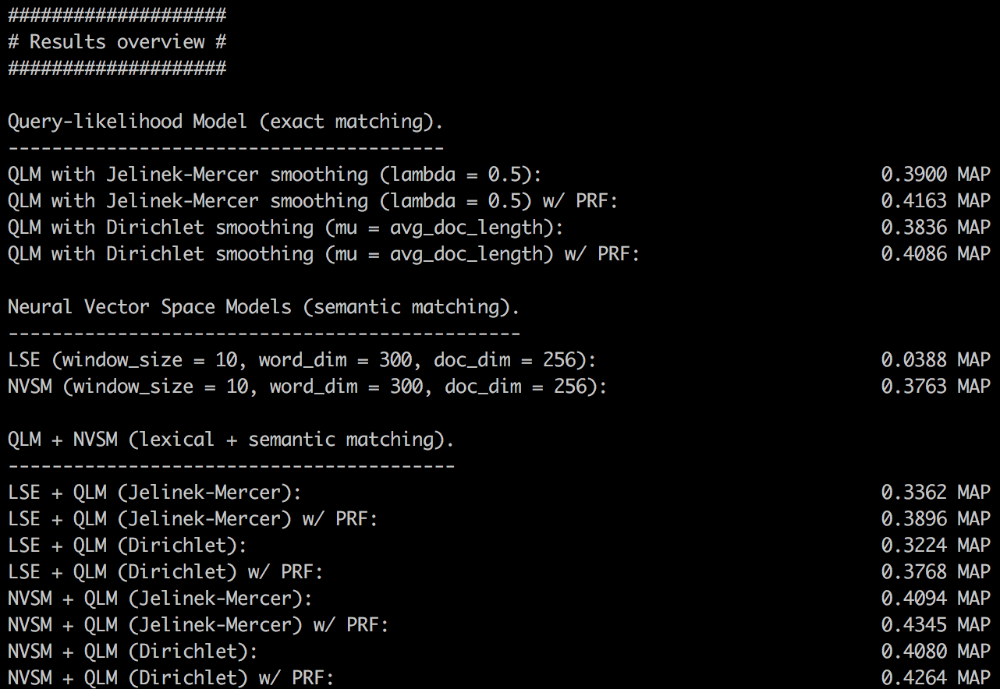
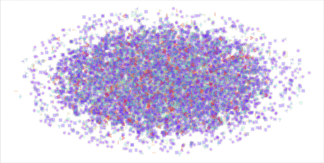

cuNVSM Tutorial
===============

The following examples showcase how models can be trained and queried using cuNVSM.

Ranking the Cranfield Collection
--------------------------------

In this example, we index the [Cranfield collection](http://ir.dcs.gla.ac.uk/resources/test_collections/cran) and subsequently rank the collection using the Query-likelihood Model, Neural Vector Space Models and combinations thereof.

Run the following script (found in the repository root):

	./rank-cranfield-collection.sh <PATH-TO-NONEXISTING-SCRATCH-DIR>
	
We now step through the script's output. In our invocation of the script, we set `<PATH-TO-NONEXISTING-SCRATCH-DIR>` to `cranfield-scratch`. First, the collection is indexed using Indri and index statistics are returned:

	#######################
	# Indexing collection #
	#######################
	
	Building index
	--------------
	Downloading Indri stoplist.dft.
	0:00: Created repository cranfield-scratch/index
	0:00: Opened /home/cvangysel/cuNVSM/test_data/cranfield_collection/cranfield.trectext
	0:00: Documents parsed: 500 Documents indexed: 500
	0:00: Documents parsed: 1000 Documents indexed: 1000
	0:00: Documents parsed: 1400 Documents indexed: 1400
	0:00: 
	0:00: Closed /home/cvangysel/cuNVSM/test_data/cranfield_collection/cranfield.trectext
	0:00: Closing index
	0:00: Finished

	Index statistics
	----------------
	[INFO]  Arguments: Namespace(index='cranfield-scratch/index', loglevel='INFO')
	[INFO]  NUM=1400
	[INFO]  LENGTH_MEDIAN=167.0
	[INFO]  LENGTH_MODE=157.0
	[INFO]  LENGTH_MEAN=186.25714285714267
	[INFO]  LENGTH_MIN=3.0
	[INFO]  LENGTH_MAX=698.0
	[INFO]  LENGTH_STD=89.8849690924
	[INFO]  TOTAL_TERMS=260760
	[INFO]  UNIQUE_TERMS=9340
	
Next, the Indri index is queried using Indri's built-in implementation of the QLM. The smoothing parameters are set automatically and we provide results for both unexpanded and expanded (using pseudo relevance) query models:

	##########################################################
	# Ranking using Query-likelihood Model (exact matching). #
	##########################################################
	
	Ranking using QLM.
	------------------
	QLM with Jelinek-Mercer smoothing (lambda = 0.5):                               0.3900 MAP
	QLM with Jelinek-Mercer smoothing (lambda = 0.5) w/ PRF:                        0.4163 MAP
	QLM with Dirichlet smoothing (mu = avg_doc_length):                             0.3836 MAP
	QLM with Dirichlet smoothing (mu = avg_doc_length) w/ PRF:                      0.4086 MAP
	
Following the QLM results, the Indri index is then used as input to learn LSE and NVSM models. The models are subsequently used for ranking and the results are as follows:

	#################################################################
	# Ranking using Neural Vector Space Models (semantic matching). #
	#################################################################
	
	Training LSE.
	-------------
	Writing LSE training logs to cranfield-scratch/nvsm/models/LSE.log.
	
	Training NVSM.
	--------------
	Writing NVSM training logs to cranfield-scratch/nvsm/models/NVSM.log.
	
	Ranking using LSE.
	------------------
	Writing LSE (epoch 100) query logs to cranfield-scratch/nvsm/runs/LSE_100.log.
	
	Ranking using NVSM.
	-------------------
	Writing NVSM (epoch 100) query logs to cranfield-scratch/nvsm/runs/NVSM_100.log.
	
	LSE (window_size = 10, word_dim = 300, doc_dim = 256):                          0.0388 MAP
	NVSM (window_size = 10, word_dim = 300, doc_dim = 256):                         0.3763 MAP
	
Finally, the QLM and NVSM matching signals are combined into an ensemble:

	###############################################
	# Ranking using combinations of QLM and NVSM. #
	###############################################
	
	Computing unsupervised combinations.
	------------------------------------
	LSE + QLM (Jelinek-Mercer):                                                     0.3362 MAP
	LSE + QLM (Jelinek-Mercer) w/ PRF:                                              0.3896 MAP
	LSE + QLM (Dirichlet):                                                          0.3224 MAP
	LSE + QLM (Dirichlet) w/ PRF:                                                   0.3768 MAP
	NVSM + QLM (Jelinek-Mercer):                                                    0.4094 MAP
	NVSM + QLM (Jelinek-Mercer) w/ PRF:                                             **0.4345 MAP**
	NVSM + QLM (Dirichlet):                                                         0.4080 MAP
	NVSM + QLM (Dirichlet) w/ PRF:                                                  **0.4264 MAP**
	
As can be seen, the unsupervised combination of NVSM and QLM with PRF always results in an improvement in MAP.

The final results look as follows:

Visualizing Reuters21578
------------------------

In this example, we index the [Reuters21578 collection](http://www.daviddlewis.com/resources/testcollections/reuters21578/) and subsequently learn and visualize document representations.

Run the following script (found in the repository root):

	./visualize-reuters-collection.sh <PATH-TO-NONEXISTING-SCRATCH-DIR>
	
The output of the script is very similar to the output of the previous example. The script generates the following animation that shows how document representations are learned over time:

